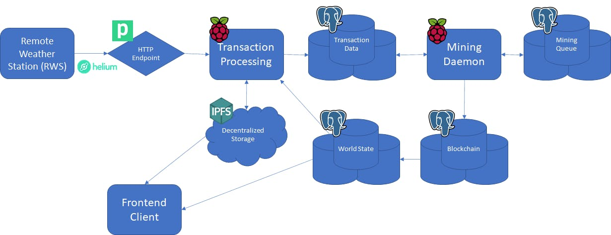

# helium-weather-network

Code and documentation for this [Hackster.io project submission](https://www.hackster.io/evan-diewald/decentralized-climate-monitoring-at-the-point-of-need-95d8bb)

To run the mining daemon on your own data, you will need to have a LoRaWAN device broadcasting to the Helium Console with a Pipedream Integration, as described in [this tutorial](https://www.hackster.io/evan-diewald/routing-sensor-data-from-helium-devices-to-google-sheets-285699).



## Raspberry Pi Setup 
1. Boot a Raspberry Pi 4 with [64-bit Raspbian](https://downloads.raspberrypi.org/raspios_arm64/images/) and run the usual updates:

```
$ sudo apt-get update
$ sudo apt-get upgrade
```
2. Clone this repository

`$ git clone https://github.com/evandiewald/helium-weather-network`

3. Setup a PostgreSQL database with remote connections using [these instructions](https://opensource.com/article/17/10/set-postgres-database-your-raspberry-pi)

It's also helpful to add a static IP to your RPi so that you can reconnect easily. I used the pgAdmin tool to create the following tables and columns (I'll figure out a better way to share the schema):
* mining_queue
  * miner_id (PK)
  * dev_eui
  * account_id
  * blocks_mined
  * valid_txns
  * invalid_txns
* chain
  * block_height (PK)
  * txn_list
  * block_hash
  * miner
  * timestamp
  * next_miner
* transaction_data
  * account_id
  * timestamp
  * ipfs_addr
  * confirmed
  * txn_hash
* world_state
  * dev_eui
  * latitude
  * longitude
  * ipfs_addr
  * account_id
  * city

I created a user named `weatherman` with password `weather` with read/write privileges

4. Download `go-ipfs v0.4.23` with this ARM64 binary

`$ wget https://github.com/ipfs/go-ipfs/releases/download/v0.5.1/go-ipfs_v0.4.23_linux-arm64.tar.gz`

Extract, `cd` into the 'go-ipfs' directory, and install with 
`$ ./install.sh`

5. Initialize IPFS and start a daemon
```
$ ipfs init
$ ipfs daemon
```
6. In a new terminal, create and activate the virtual environment
```
$ cd helium-weather-network
~/helium-weather-network $ virtualenv venv
~/helium-weather-network $ source venv/bin/activate
```

7. Install `requirements.txt`

`(venv) ~/helium-weather-network $ pip3 install -r requirements.txt`

8. Edit the connection information in `mining_daemon.py` to match your PostgreSQL host location. You can also adjust the webhook URL for your specific Pipedream endpoint in `webhook_retrieval.py`.

8. Run the mining daemon
`(venv) ~/helium-weather-network $ python3 mining_daemon.py`
If all goes well, you will see a similar output in the terminal:

```
(venv) pi@raspberrypi:~/helium-weather-network $ python3 mining_daemon.py
Starting mining daemon...
{'Name': '1A2A3A4A5A6A7A8A.data', 'Hash': 'QmVKZeBV8GcnsUcbdCJqJUN7Buom3fHUoBr1XkHcwGRacj', 'Size': '12644'}
Updated ipfs_address.
{'Name': '2BC5A6DCF784E9A1.data', 'Hash': 'QmbucbPvQYBTYiyMEETBuNze7KxFXE9zrRVBe6ecXQBnAt', 'Size': '19689'}
Nothing to change.
My turn to mine!
City-wide temperature (C):    26.04
Hyper-local temperature (C):  25.0
Block mined successfully!
 {'block_height': 12, 'txn_list': "['8f76a4b19cbba5c3c8d49b58ba56b41bb1d8cb5eeb32c469951498124c163882']", 'block_hash': '1ac603bad6d49049f97d8b9dc54fdab16c6198c1ff10fba3435de2321b66f1cd', 'miner': 5, 'next_miner': 4}
Rewards Updated.
```
